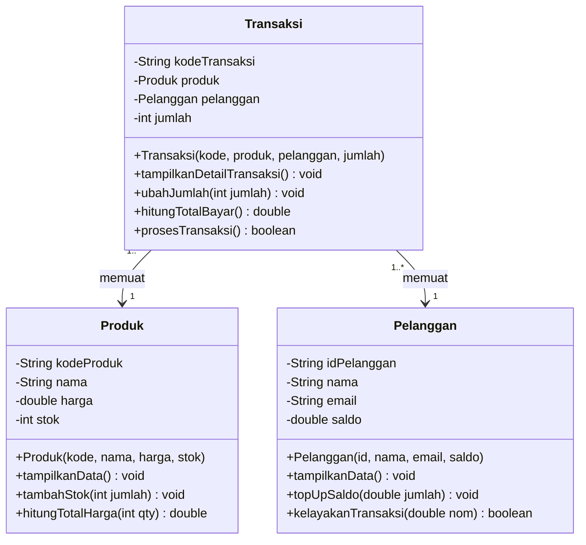

# LAPORAN PRAKTIKUM PEMROGRAMAN BERORIENTASI OBYEK
## MODUL 2: Implementasi Class, Object, Attribute, Method, dan Constructor

### 1. Profil Proyek
- **Nama Proyek:** Sistem Toko Online (E-Commerce Management)
- **Pengembang:** Arjuna Lanang Ading Warsana
- **Mata Kuliah:** Workshop Pemrograman Framework (PBO)
- **Basis Proyek (P1):** Sistem Manajemen Produk & Transaksi Toko

---

### 2. Product Goal
Membangun sistem toko online yang terstruktur dan modular untuk mengelola katalog produk, profil pelanggan, dan alur transaksi secara otomatis dengan mengimplementasikan prinsip-prinsip Pemrograman Berorientasi Obyek (PBO).

---

### 3. Sprint Goal (Sprint P2)
Mengimplementasikan class utama proyek (`Produk`, `Pelanggan`, `Transaksi`) sehingga objek dapat dibuat, diberi data awal melalui constructor, serta menjalankan operasi dasar method (tanpa parameter, dengan parameter, dan return value).

---

### 4. Sprint Backlog (P2)
| ID | Sprint Backlog Item | Status |
|---|---|---|
| SB-01 | Membuat class `Produk` beserta atribut (`kodeProduk`, `nama`, `harga`, `stok`) | **DONE** |
| SB-02 | Membuat class `Pelanggan` beserta atribut (`idPelanggan`, `nama`, `email`, `saldo`) | **DONE** |
| SB-03 | Membuat class `Transaksi` beserta atribut (`kodeTransaksi`, `produk`, `pelanggan`, `jumlah`) | **DONE** |
| SB-04 | Membuat constructor pada setiap class untuk inisialisasi objek | **DONE** |
| SB-05 | Membuat method utama (tanpa param, dengan param, return value) | **DONE** |
| SB-06 | Membuat minimal 2 objek per class dan skenario pengujian pada `Main.java` | **DONE** |

---

### 5. Refinement Objek dan Spesifikasi Class
| Class | Attribute | Method | Constructor |
|---|---|---|---|
| **Produk** | • `kodeProduk` (String)<br/>• `nama` (String)<br/>• `harga` (double)<br/>• `stok` (int) | • `tampilkanData()`<br/>• `tambahStok(int)`<br/>• `hitungTotalHarga(int)`<br/>• `getNama()`, `getHarga()` | `Produk(kodeProduk, nama, harga, stok)` |
| **Pelanggan** | • `idPelanggan` (String)<br/>• `nama` (String)<br/>• `email` (String)<br/>• `saldo` (double) | • `tampilkanData()`<br/>• `topUpSaldo(double)`<br/>• `kelayakanTransaksi(double)`<br/>• `getNama()`, `getSaldo()` | `Pelanggan(idPelanggan, nama, email, saldo)` |
| **Transaksi** | • `kodeTransaksi` (String)<br/>• `produk` (Produk)<br/>• `pelanggan` (Pelanggan)<br/>• `jumlah` (int) | • `tampilkanDetailTransaksi()`<br/>• `ubahJumlah(int)`<br/>• `hitungTotalBayar()`<br/>• `prosesTransaksi()` | `Transaksi(kodeTransaksi, produk, pelanggan, jumlah)` |

---

### 6. Diagram Sederhana Class (UML Diagram)


<details>
<summary><b>Lihat Format Text / ASCII UML Diagram</b></summary>

```text
  +-----------------------------------+     +-----------------------------------+
  |              Produk               |     |             Pelanggan             |
  +-----------------------------------+     +-----------------------------------+
  | - kodeProduk : String             |     | - idPelanggan : String            |
  | - nama : String                   |     | - nama : String                   |
  | - harga : double                  |     | - email : String                  |
  | - stok : int                      |     | - saldo : double                  |
  +-----------------------------------+     +-----------------------------------+
  | + Produk(kode, nama, harga, stok) |     | + Pelanggan(id, nama, email, ...) |
  | + tampilkanData()                 |     | + tampilkanData()                 |
  | + tambahStok(jumlah: int)         |     | + topUpSaldo(jumlah: double)      |
  | + hitungTotalHarga(qty: int)      |     | + kelayakanTransaksi(nom: double) |
  +-----------------------------------+     +-----------------------------------+
                    ^                                         ^
                    | 1                                       | 1
                    +--------------------+--------------------+
                                         | *
                           +----------------------------+
                           |         Transaksi          |
                           +----------------------------+
                           | - kodeTransaksi : String   |
                           | - produk : Produk          |
                           | - pelanggan : Pelanggan    |
                           | - jumlah : int             |
                           +----------------------------+
                           | + Transaksi(...)           |
                           | + tampilkanDetail()        |
                           | + ubahJumlah(jumlah: int)  |
                           | + hitungTotalBayar()       |
                           | + prosesTransaksi()        |
                           +----------------------------+
```
</details>

---

### 7. Hasil Executing / Running Program (`Main.java`)
```text
=================================================
   P2 - IMPLEMENTASI CLASS, OBJECT, ATTRIBUTE,  
           METHOD, DAN CONSTRUCTOR               
=================================================

=== 1. PEMBUATAN OBJEK (CONSTRUCTOR) ===
[SUCCESS] Objek produk1, produk2, pelanggan1, pelanggan2 berhasil dibuat.

=== 2. PENGUJIAN METHOD TANPA PARAMETER ===
--- Detail Produk ---
Kode Produk : P001
Nama Produk : Laptop Gaming Asus
Harga       : Rp 15.000.000,00
Stok        : 10

--- Detail Pelanggan ---
ID Pelanggan : C001
Nama         : Arjuna Lanang
Email        : arjuna@email.com
Saldo        : Rp 20.000.000,00

=== 3. PENGUJIAN METHOD DENGAN PARAMETER ===
[INFO] Stok Laptop Gaming Asus berhasil ditambahkan sebanyak 5. Stok sekarang: 15
[INFO] Top up saldo untuk Budi Santoso sebesar Rp 2.000.000,00 berhasil. Saldo baru: Rp 6.000.000,00

=== 4. PENGUJIAN METHOD DENGAN RETURN VALUE ===
Kalkulasi total harga 2 unit Laptop Gaming Asus: Rp 30.000.000,00
Apakah pelanggan Budi Santoso layak belanja Rp 5.000.000? YA

=== 5. PEMBUATAN OBJEK TRANSAKSI & OPERASI BERSAMA ===
--- Transaksi 1 ---
========================================
        DETAIL TRANSAKSI TOKO           
========================================
Kode Transaksi : TRX001
Pelanggan      : Arjuna Lanang
Produk Dibeli  : Laptop Gaming Asus
Harga Satuan   : Rp 15.000.000,00
Jumlah Beli    : 1
Total Bayar    : Rp 15.000.000,00
========================================

[PROSES TRANSAKSI TRX001]
[BERHASIL] Transaksi TRX001 berhasil diproses!
Sisa stok Laptop Gaming Asus: 14
Sisa saldo Arjuna Lanang: Rp 5.000.000,00

--- Transaksi 2 (Mengubah Jumlah dengan Parameter) ---
[INFO] Jumlah pembelian transaksi TRX002 diubah menjadi 2
[PROSES TRANSAKSI TRX002]
[GAGAL] Saldo pelanggan Budi Santoso tidak mencukupi. (Saldo: Rp 6.000.000, Total: Rp 10.000.000)
```

---

### 8. Sprint Review
| Item Kriteria | Hasil Implementasi |
|---|---|
| **Class berhasil dibuat** | Berhasil dibuat 3 class: `Produk`, `Pelanggan`, `Transaksi` |
| **Object berhasil dibuat** | Berhasil dibuat minimal 2 objek per class pada `Main.java` |
| **Constructor berjalan** | Berjalan sempurna menginisialisasi seluruh atribut objek |
| **Method berjalan** | Berhasil mengeksekusi method tanpa param, param, & return value |
| **Program dapat dijalankan** | Berhasil dikompilasi (`javac`) dan dijalankan (`java`) tanpa error |
| **Kendala** | Tidak ada kendala teknis utama selama pengerjaan Modul 2 |

---

### 9. Sprint Retrospective
- **What Went Well?** Seluruh struktur class, atribut, constructor, dan method berhasil dibangun dengan bersih dan rapi. Seluruh skenario pengujian pada `Main.java` berjalan sesuai ekspektasi.
- **What Went Wrong?** Diperlukan perhatian khusus pada validasi kondisi stok dan saldo sebelum transaksi diproses agar tidak terjadi nilai minus.
- **Improvement:** Pada Sprint P3 berikutnya, atribut class akan dienkapsulasi menggunakan access modifier *private* serta ditambahkan getter/setter dan validasi ketat.
