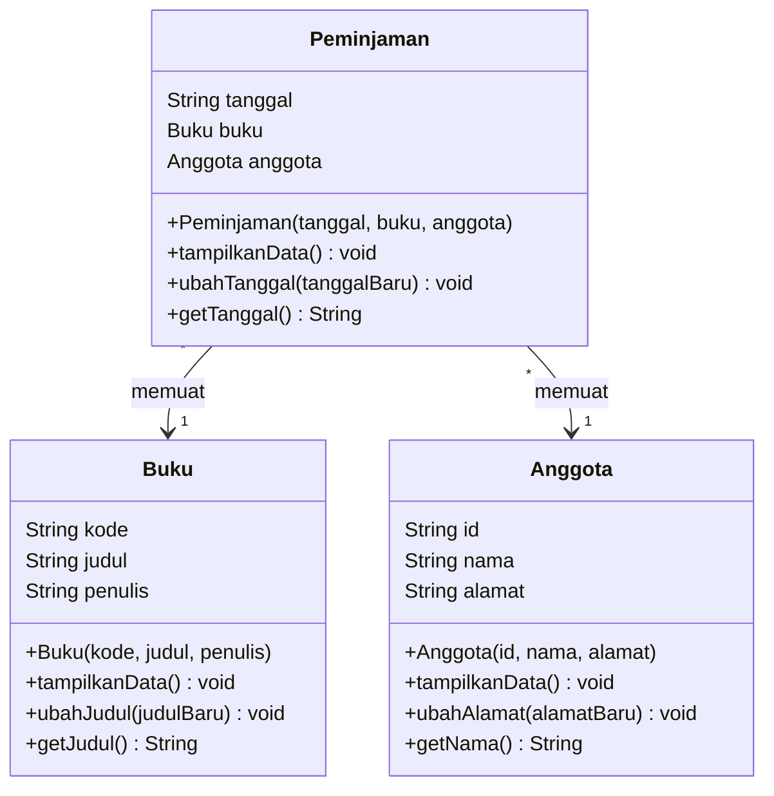

# LAPORAN PRAKTIKUM PEMROGRAMAN BERORIENTASI OBYEK
## MODUL 2: Implementasi Class, Object, Attribute, Method, dan Constructor

### 1. Profil Proyek
- **Nama Proyek:** Sistem Perpustakaan
- **Pengembang:** Arjuna Lanang Adiwarsana
- **Mata Kuliah:** Workshop Pemrograman Framework (PBO)
- **Basis Proyek (P2):** Sistem Manajemen Buku, Anggota & Peminjaman Perpustakaan

---

### 2. Product Goal
Membangun sistem pencatatan peminjaman buku perpustakaan yang terstruktur.

---

### 3. Sprint Goal (Sprint P2)
Mengimplementasikan class utama proyek (`Buku`, `Anggota`, `Peminjaman`) sehingga object dapat dibuat, diberi data awal melalui constructor, serta menjalankan operasi dasar method (tanpa parameter, dengan parameter, dan return value).

---

### 4. Sprint Backlog (P2)
| ID | Sprint Backlog Item | Status |
|---|---|---|
| SB-01 | Membuat class `Buku` beserta atribut (`kode`, `judul`, `penulis`) | **Done** |
| SB-02 | Membuat class `Anggota` beserta atribut (`id`, `nama`, `alamat`) | **Done** |
| SB-03 | Membuat class `Peminjaman` beserta atribut (`tanggal`, `buku`, `anggota`) | **Done** |
| SB-04 | Membuat constructor pada setiap class untuk inisialisasi objek | **Done** |
| SB-05 | Membuat method utama (tanpa param, dengan param, return value) | **Done** |
| SB-06 | Membuat minimal 2 objek per class dan skenario pengujian pada `Main.java` | **Done** |

---

### 5. Refinement Object dan Spesifikasi Class
| Class | Attribute | Method | Constructor |
|---|---|---|---|
| **Buku** | • `kode` (String)<br/>• `judul` (String)<br/>• `penulis` (String) | • `tampilkanData()`<br/>• `ubahJudul(String)`<br/>• `getJudul()` | `Buku(kode, judul, penulis)` |
| **Anggota** | • `id` (String)<br/>• `nama` (String)<br/>• `alamat` (String) | • `tampilkanData()`<br/>• `ubahAlamat(String)`<br/>• `getNama()` | `Anggota(id, nama, alamat)` |
| **Peminjaman** | • `tanggal` (String)<br/>• `buku` (Buku)<br/>• `anggota` (Anggota) | • `tampilkanData()`<br/>• `ubahTanggal(String)`<br/>• `getTanggal()` | `Peminjaman(tanggal, buku, anggota)` |

---

### 6. Diagram Class Sederhana (UML Diagram)
Relasi dan hubungan antar class dalam proyek Sistem Perpustakaan:



<details>
<summary><b>Lihat Format Text / ASCII UML Diagram</b></summary>

```text
  +-----------------------------------+     +-----------------------------------+
  |               Buku                |     |              Anggota              |
  +-----------------------------------+     +-----------------------------------+
  | String kode                       |     | String id                         |
  | String judul                      |     | String nama                       |
  | String penulis                    |     | String alamat                     |
  +-----------------------------------+     +-----------------------------------+
  | Buku(kode, judul, penulis)        |     | Anggota(id, nama, alamat)         |
  | void tampilkanData()              |     | void tampilkanData()              |
  | void ubahJudul(judulBaru)         |     | void ubahAlamat(alamatBaru)       |
  | String getJudul()                 |     | String getNama()                  |
  +-----------------------------------+     +-----------------------------------+
                    ^                                         ^
                    | 1                                       | 1
                    +--------------------+--------------------+
                                         | *
                           +----------------------------+
                           |         Peminjaman         |
                           +----------------------------+
                           | String tanggal             |
                           | Buku buku                  |
                           | Anggota anggota            |
                           +----------------------------+
                           | Peminjaman(...)            |
                           | void tampilkanData()       |
                           | void ubahTanggal(tglBaru)  |
                           | String getTanggal()        |
                           +----------------------------+
```
</details>

---

### 7. Hasil Executing / Running Program (`Main.java`)
```text
=================================================
   P2 - IMPLEMENTASI CLASS, OBJECT, ATTRIBUTE,  
           METHOD, DAN CONSTRUCTOR               
             SISTEM PERPUSTAKAAN                 
=================================================

=== 1. PEMBUATAN OBJEK (CONSTRUCTOR) ===
[SUCCESS] Minimal 2 Objek per class berhasil dibuat.

=== 2. PENGUJIAN METHOD TANPA PARAMETER ===
--- Detail Buku ---
Kode Buku : B001
Judul Buku: Pemrograman Java Dasar
Penulis   : Nirwana Haidar

--- Detail Buku ---
Kode Buku : B002
Judul Buku: Struktur Data & Algoritma
Penulis   : Budi Raharjo

--- Detail Anggota ---
ID Anggota : A001
Nama       : Arjuna Lanang
Alamat     : Jl. Sumenep No. 10

--- Detail Anggota ---
ID Anggota : A002
Nama       : Siti Aminah
Alamat     : Jl. Pemuda No. 45

========================================
      DETAIL PEMINJAMAN PERPUSTAKAAN    
========================================
Tanggal Pinjam : 2026-09-01
Peminjam       : Arjuna Lanang
Buku Dipinjam  : Pemrograman Java Dasar
========================================

=== 3. PENGUJIAN METHOD DENGAN PARAMETER ===
[INFO] Judul buku dengan kode B001 berhasil diubah menjadi: "Pemrograman Java Lanjut & Framework"
[INFO] Alamat anggota Siti Aminah (A002) berhasil diubah menjadi: Jl. Merdeka No. 88, Surabaya
[INFO] Tanggal peminjaman untuk anggota Arjuna Lanang berhasil diubah menjadi: 2026-09-02

=== 4. PENGUJIAN METHOD DENGAN RETURN VALUE ===
Judul Buku 1 (via getJudul())    : Pemrograman Java Lanjut & Framework
Nama Anggota 2 (via getNama())   : Siti Aminah
Tanggal Pinjam 1 (via getTanggal()): 2026-09-02

=== 5. RINGKASAN DATA AKHIR PEMINJAMAN ===
========================================
      DETAIL PEMINJAMAN PERPUSTAKAAN    
========================================
Tanggal Pinjam : 2026-09-02
Peminjam       : Arjuna Lanang
Buku Dipinjam  : Pemrograman Java Lanjut & Framework
========================================

========================================
      DETAIL PEMINJAMAN PERPUSTAKAAN    
========================================
Tanggal Pinjam : 2026-09-05
Peminjam       : Siti Aminah
Buku Dipinjam  : Struktur Data & Algoritma
========================================

=================================================
       PENGUJIAN MODUL 2 SELESAI DENGAN SUKSES!  
=================================================
```

---

### 8. Sprint Review
| Item Kriteria | Hasil Implementasi |
|---|---|
| **Class berhasil dibuat** | Berhasil dibuat 3 class: `Buku`, `Anggota`, `Peminjaman` |
| **Object berhasil dibuat** | Berhasil dibuat minimal 2 objek per class pada `Main.java` |
| **Constructor berjalan** | Berjalan sempurna menginisialisasi seluruh atribut objek |
| **Method berjalan** | Berhasil mengeksekusi method tanpa param, param, & return value |
| **Program dapat dijalankan** | Berhasil dikompilasi (`javac`) dan dijalankan (`java`) tanpa error |
| **Kendala** | Tidak ada kendala teknis utama selama pengerjaan Modul 2 |

---

### 9. Sprint Retrospective
- **What Went Well?** Seluruh struktur class (Buku, Anggota, Peminjaman), atribut, constructor, dan ketiga jenis method berhasil dibangun dengan rapi serta dijalankan tanpa error.
- **What Went Wrong?** Atribut class masih menggunakan tingkat akses default/package-private sehingga nilainya masih dapat diubah secara langsung dari luar class tanpa validasi.
- **Improvement:** Pada Sprint P3 berikutnya, seluruh atribut class akan dienkapsulasi menggunakan access modifier *private* serta ditambahkan getter, setter, dan validasi data terkontrol.
