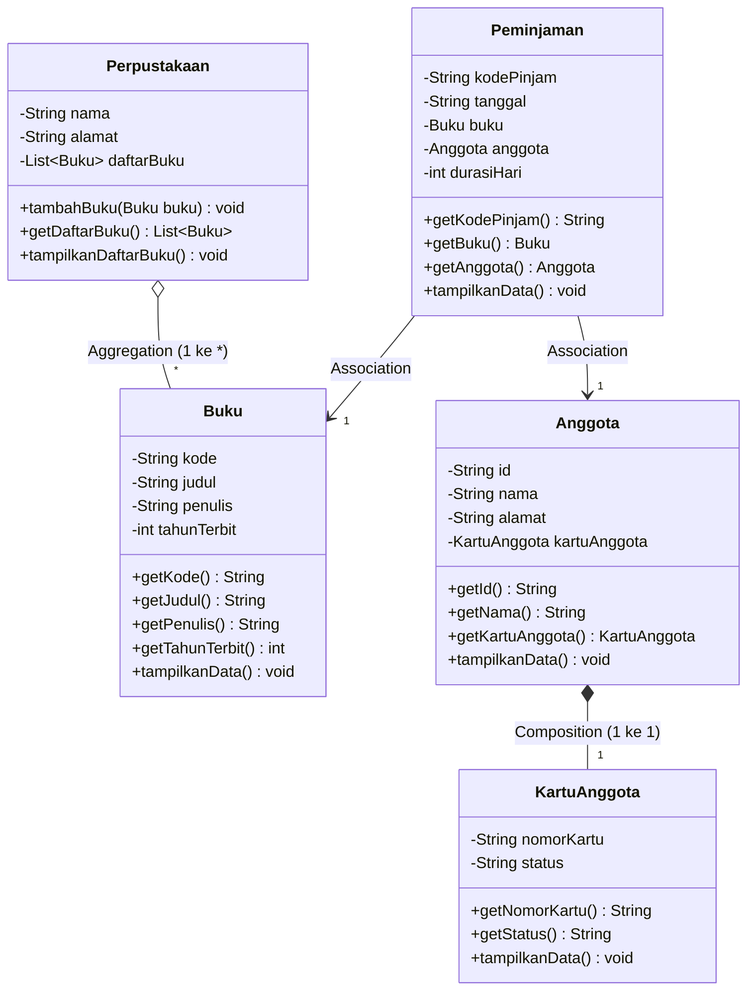

# LAPORAN PRAKTIKUM PEMROGRAMAN BERORIENTASI OBYEK
## MODUL 4: Relasi Antarobject (Association, Aggregation, dan Composition)

### 1. Profil Proyek
- **Nama Proyek:** Sistem Manajemen Perpustakaan
- **Nama Mahasiswa / NRP:** Arjuna Lanang Adiwarsana / 3125522010
- **Program Studi / Kampus:** D3 PJJ Teknik Informatika - PENS PSDKU Sumenep
- **Mata Kuliah:** Workshop Pemrograman Framework (PBO)
- **Fokus Pertemuan (P4):** Menghubungkan class proyek menggunakan relasi Association, Aggregation, dan Composition

---

### 2. Sprint Goal (P4)
Menghubungkan class utama sistem perpustakaan (`Buku`, `Anggota`, `KartuAnggota`, `Peminjaman`, dan `Perpustakaan`) agar objek dapat saling bertukar data dan berinteraksi secara modular sesuai konsep relasi objek.

---

### 3. Sprint Backlog (P4)
| ID | Sprint Backlog Item | Status |
|---|---|---|
| **SB-01** | Mengidentifikasi kebutuhan relasi antarclass dalam sistem | **Done** |
| **SB-02** | Membuat pembaruan class diagram UML beserta cardinalities | **Done** |
| **SB-03** | Implementasi relasi association pada class Peminjaman | **Done** |
| **SB-04** | Implementasi relasi aggregation pada class Perpustakaan | **Done** |
| **SB-05** | Implementasi relasi composition pada class Anggota dan KartuAnggota | **Done** |
| **SB-06** | Membuat skenario pengujian interaksi objek di Main.java | **Done** |

---

### 4. Bagian A: Tabel Identifikasi Relasi Antarclass
| Class A | Class B | Relasi | Alasan Pemilihan Relasi |
|---|---|---|---|
| **Peminjaman** | **Anggota** | **Association** | Anggota melakukan peminjaman buku. Objek Anggota berdiri sendiri dan hanya direferensikan saat ada transaksi peminjaman. |
| **Peminjaman** | **Buku** | **Association** | Buku dipinjam dalam transaksi peminjaman. Peminjaman hanya meminjam data referensi Buku tanpa memiliki daur hidup buku tersebut. |
| **Perpustakaan** | **Buku** | **Aggregation** | Perpustakaan memiliki koleksi daftar buku. Objek Buku dibuat di luar dan tetap ada meskipun objek Perpustakaan ditiadakan. |
| **Anggota** | **KartuAnggota** | **Composition** | Kartu anggota dibuat langsung di dalam constructor Anggota. Kartu tidak dapat berdiri sendiri jika objek Anggota tidak ada. |

---

### 5. Bagian B: Pembaruan Class Diagram (UML)



---

### 6. Penjelasan Implementasi Relasi (Bagian C, D, E)
1. **Bagian C: Association (`Peminjaman` - `Anggota` / `Buku`)**
   Class `Peminjaman` memiliki atribut `private Anggota anggota;` dan `private Buku buku;`. Keduanya berinteraksi lewat parameter constructor dan method. Daur hidup objek mandiri; menghapus transaksi peminjaman tidak akan menghapus data anggota atau buku.
2. **Bagian D: Aggregation (`Perpustakaan` - `Buku`)**
   Class `Perpustakaan` memiliki atribut `private List<Buku> daftarBuku;`. Objek buku dibuat terlebih dahulu di luar perpustakaan lalu dimasukkan lewat method `tambahBuku(buku)`. Jika objek perpustakaan dihapus, buku tetap ada di memori.
3. **Bagian E: Composition (`Anggota` - `KartuAnggota`)**
   Class `Anggota` memiliki atribut `private KartuAnggota kartuAnggota;` yang langsung diinisialisasi di dalam constructor Anggota (`this.kartuAnggota = new KartuAnggota(...)`). Kartu anggota tidak dibuat terpisah di luar class Anggota.

---

### 7. Hasil Eksekusi Program (`Main.java`)
```text
=================================================
   PRAKTIKUM MODUL 4 - RELASI ANTAR OBJEK        
   SISTEM MANAJEMEN PERPUSTAKAAN                 
=================================================

=== 1. UJI PEMBUATAN OBJEK (TEST 1) ===
[Sukses] Seluruh objek berhasil diinisialisasi.

=== 2. UJI INTERAKSI ANTAR OBJEK (TEST 2) ===
--- Cek Data Anggota & Kartu (Komposisi) ---
ID Anggota   : A001
Nama         : Arjuna Lanang Adiwarsana
Alamat       : Jl. Trunojoyo No. 45, Sumenep
Nomor Kartu  : KTA-A001 (Aktif)

ID Anggota   : A002
Nama         : Siti Aminah
Alamat       : Jl. KH. Agus Salim No. 12, Sumenep
Nomor Kartu  : KTA-A002 (Aktif)

--- Menambahkan Buku ke Perpustakaan (Agregasi) ---
[Sukses] Buku "Pemrograman Java" ditambahkan ke koleksi Perpustakaan PENS Sumenep
[Sukses] Buku "Struktur Data & Algoritma" ditambahkan ke koleksi Perpustakaan PENS Sumenep
[Sukses] Buku "Rekayasa Perangkat Lunak" ditambahkan ke koleksi Perpustakaan PENS Sumenep

--- Membuat Transaksi Peminjaman (Asosiasi) ---
[Sukses] Transaksi peminjaman berhasil dibuat.

=== 3. UJI PENGGUNAAN DATA OBJEK LAIN (TEST 3) ===
=== Koleksi Buku: Perpustakaan PENS Sumenep ===
Lokasi: Gedung A Lantai 2 Kampus PSDKU
Jumlah Koleksi: 3 Buku
----------------------------------------
1. [B001] Pemrograman Java (Nirwana Haidar, 2024)
2. [B002] Struktur Data & Algoritma (Budi Raharjo, 2022)
3. [B003] Rekayasa Perangkat Lunak (Ian Sommerville, 2023)
----------------------------------------

--- Detail Transaksi Peminjaman 1 ---
Kode Pinjam    : PJ-001
Tanggal Pinjam : 2026-09-22
Durasi Pinjam  : 7 Hari
Peminjam       : Arjuna Lanang Adiwarsana
No. Kartu      : KTA-A001
Buku Dipinjam  : Pemrograman Java
Penulis Buku   : Nirwana Haidar

--- Detail Transaksi Peminjaman 2 ---
Kode Pinjam    : PJ-002
Tanggal Pinjam : 2026-09-23
Durasi Pinjam  : 14 Hari
Peminjam       : Siti Aminah
No. Kartu      : KTA-A002
Buku Dipinjam  : Struktur Data & Algoritma
Penulis Buku   : Budi Raharjo

--- Bukti Objek Buku Tetap Berdiri Sendiri (Agregasi) ---
Judul buku 1 via objek asli : Pemrograman Java
Penulis buku 1              : Nirwana Haidar
(Objek Buku tetap dapat diakses mandiri meskipun terdaftar di Perpustakaan)

=================================================
   PENGUJIAN MODUL 4 SELESAI                     
=================================================
```

---

### 8. Skenario Pengujian (Bagian F)
| Skenario | Keterangan Pengujian | Target | Status |
|---|---|---|---|
| **Test 1** | Pembuatan objek `Buku`, `Perpustakaan`, serta `Anggota` yang otomatis membuat `KartuAnggota`. | Inisialisasi Objek | **Berhasil** |
| **Test 2** | Menambahkan buku ke perpustakaan (agregasi) dan membuat transaksi peminjaman (asosiasi). | Interaksi Objek | **Berhasil** |
| **Test 3** | Mengakses data judul buku dan nama anggota dari method pada class `Peminjaman` dan `Perpustakaan`. | Pemanggilan Method Antar Objek | **Berhasil** |

---

### 9. Sprint Review
| Item Evaluasi | Hasil Evaluasi |
|---|---|
| **Class diagram diperbarui** | Sudah diperbarui dengan 5 class dan notasi relasi UML |
| **Association berhasil** | Class Peminjaman berhasil menghubungkan Anggota dan Buku |
| **Aggregation berhasil** | Class Perpustakaan berhasil menampung list Buku dari luar |
| **Composition berhasil** | Class Anggota berhasil membuat objek KartuAnggota di constructor |
| **Object dapat berinteraksi** | Semua objek dapat bertukar data via method getter/setter |
| **Program berjalan** | Program berhasil dikompilasi dan dijalankan tanpa error |
| **Kendala** | Tidak ada kendala, alur logika program berjalan sesuai rancangan |

---

### 10. Sprint Retrospective
- **What Went Well?** Seluruh relasi berhasil diterapkan dengan baik. `Peminjaman` dapat membaca data `Anggota` dan `Buku`, `Perpustakaan` dapat mengelola daftar buku, serta `KartuAnggota` terikat langsung dengan `Anggota`.
- **What Went Wrong?** Sempat perlu penyesuaian saat membedakan cara inisialisasi objek pada agregasi (dibuat di luar) dengan komposisi (dibuat di dalam constructor).
- **Improvement:** Pada praktikum berikutnya (P5 Inheritance), class dapat dirapikan lagi menggunakan superclass untuk class yang memiliki atribut serupa.
