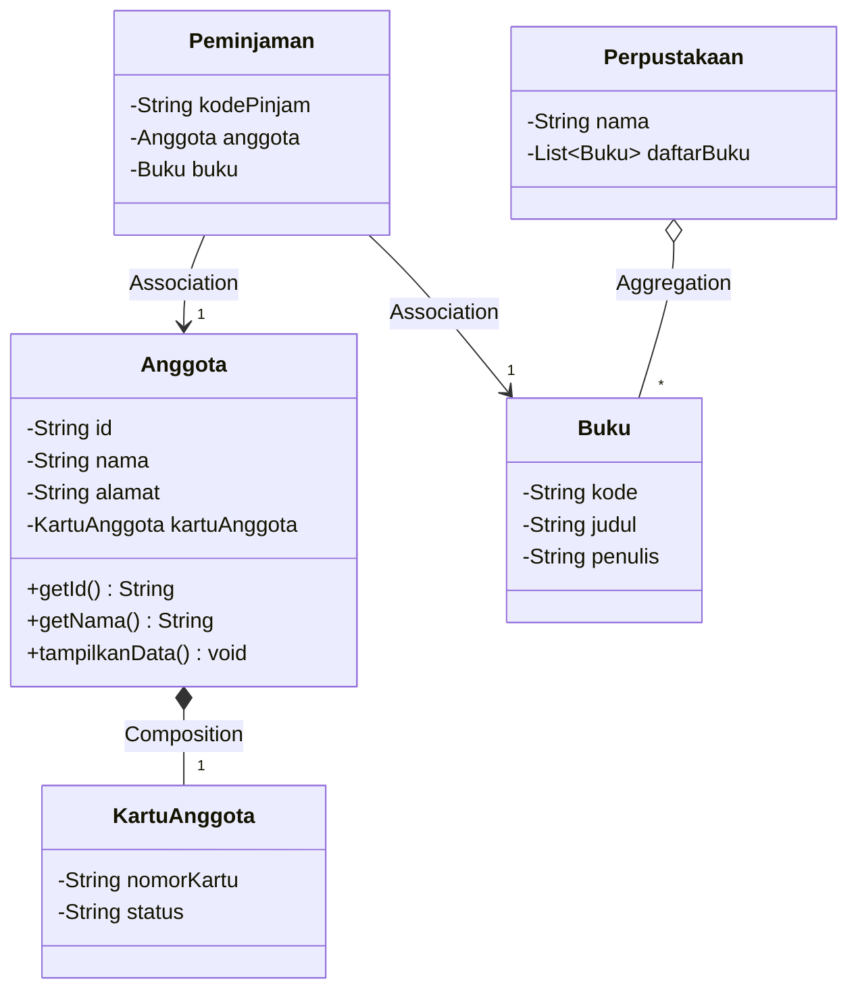
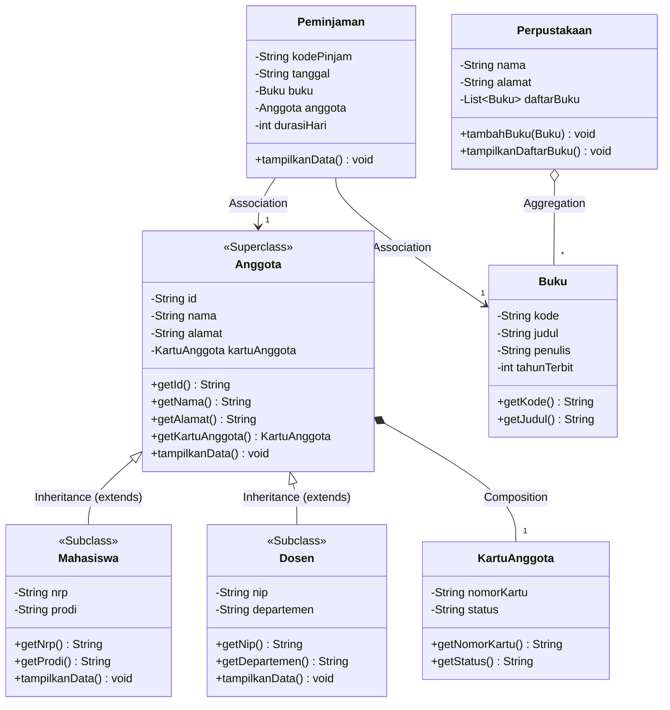

# LAPORAN PRAKTIKUM PEMROGRAMAN BERORIENTASI OBYEK
## MODUL 5: Inheritance, Generalization, Superclass, dan Subclass

### 1. Profil Proyek
- **Nama Proyek:** Sistem Manajemen Perpustakaan (Refactoring Inheritance)
- **Nama Mahasiswa / NRP:** Arjuna Lanang Adiwarsana / 3125522010
- **Program Studi / Kampus:** D3 PJJ Teknik Informatika - PENS PSDKU Sumenep
- **Mata Kuliah:** Workshop Pemrograman Berorientasi Obyek (PBO)
- **Fokus Pertemuan (P5):** Refactoring proyek P4 menggunakan konsep Generalization, Superclass, Subclass (`extends`), dan `super`.

---

### 2. Sprint Goal (P5)
Memperbaiki desain proyek P4 dengan mengidentifikasi class yang memiliki karakteristik serupa dan melakukan generalization menggunakan inheritance, menghasilkan Superclass `Anggota` serta Subclass `Mahasiswa` dan `Dosen` tanpa merusak relasi yang telah dibangun pada P4.

---

### 3. Sprint Backlog (P5)
| ID | Sprint Backlog Item | Status |
|---|---|---|
| **SB-01** | Mencari class/entitas yang memiliki kesamaan atribut (duplikasi) | **Done** |
| **SB-02** | Menentukan superclass (`Anggota`) untuk menampung atribut umum | **Done** |
| **SB-03** | Menentukan subclass (`Mahasiswa` & `Dosen`) untuk atribut khusus | **Done** |
| **SB-04** | Memperbarui class diagram UML sebelum dan sesudah refactoring | **Done** |
| **SB-05** | Implementasi pewarisan class menggunakan keyword `extends` | **Done** |
| **SB-06** | Implementasi pemanggilan constructor superclass menggunakan `super(...)` | **Done** |
| **SB-07** | Melakukan pengujian inheritance dan relasi pada `Main.java` | **Done** |

---

### 4. Bagian A: Audit Class & Identifikasi Generalization
Hasil audit terhadap entitas anggota perpustakaan untuk menghilangkan redundansi kode:

| Class | Attribute Umum (Superclass) | Attribute Khusus (Subclass) |
|---|---|---|
| **Mahasiswa** | `id`, `nama`, `alamat`, `kartuAnggota` | `nrp`, `prodi` |
| **Dosen** | `id`, `nama`, `alamat`, `kartuAnggota` | `nip`, `departemen` |

**Kandidat Hasil Generalisasi:**
- **Superclass:** `Anggota`
- **Subclass:** `Mahasiswa` (extends `Anggota`), `Dosen` (extends `Anggota`)

---

### 5. Bagian B: Pembaruan Class Diagram (UML)

#### A. Class Diagram Sebelum Refactoring (P4)


#### B. Class Diagram Setelah Refactoring (P5 - Inheritance)


---

### 6. Penjelasan Hubungan is-a & Manfaat Refactoring
1. **Hubungan `is-a`:**
   - `Mahasiswa` **is-a** `Anggota`: Mahasiswa memiliki seluruh identitas dan hak akses anggota perpustakaan ditambah data akademik seperti NRP dan Program Studi.
   - `Dosen` **is-a** `Anggota`: Dosen adalah anggota resmi perpustakaan dengan data tambahan NIP dan Departemen.
2. **Perbedaan `is-a` vs `has-a`:**
   - Relasi *is-a* dimodelkan dengan inheritance (`extends`).
   - Relasi *has-a* dimodelkan dengan komposisi (`Anggota has-a KartuAnggota`) atau agregasi (`Perpustakaan has-a Buku`).
3. **Manfaat Refactoring:**
   - **Mengurangi Duplikasi:** Atribut dan method umum (`id`, `nama`, `alamat`, `kartuAnggota`, `getNama()`, dll.) cukup ditulis satu kali di class `Anggota`.
   - **Struktur Class Lebih Jelas:** Hierarki kelas terstruktur rapi sesuai domain masalah.
   - **Maintenance Lebih Mudah:** Perubahan pada atribut dasar anggota cukup dilakukan di Superclass `Anggota` tanpa menyentuh seluruh Subclass.

---

### 7. Hasil Eksekusi Program (`Main.java`)
```text
=================================================
   PRAKTIKUM MODUL 5 - INHERITANCE & SUBCLASS    
   SISTEM MANAJEMEN PERPUSTAKAAN                 
=================================================

=== 1. UJI INSTANSIASI SUBCLASS & SUPER CONSTRUCTOR ===
[Sukses] Objek Mahasiswa dan Dosen berhasil diinstansiasi via super().

=== 2. UJI AKSES METHOD SUPERCLASS (INHERITANCE) ===
--- Akses Data Mahasiswa via Method Superclass ---
Nama (Superclass)   : Arjuna Lanang Adiwarsana
Alamat (Superclass) : Jl. Trunojoyo No. 45, Sumenep
No. Kartu (Super)   : KTA-A001
NRP (Subclass)      : 3125522010
Prodi (Subclass)    : D3 PJJ Teknik Informatika

--- Akses Data Dosen via Method Superclass ---
Nama (Superclass)   : Nirwana Haidar Hari, S.Pd., M.Kom.
Alamat (Superclass) : Jl. Raya Lenteng No. 88, Sumenep
No. Kartu (Super)   : KTA-A002
NIP (Subclass)      : 198801232024011001
Departemen (Sub)    : Teknik Informatika

=== 3. DETAIL LENGKAP OBJEK SUBCLASS ===
--- Data Mahasiswa ---
ID Anggota   : A001
Nama         : Arjuna Lanang Adiwarsana
Alamat       : Jl. Trunojoyo No. 45, Sumenep
Nomor Kartu  : KTA-A001 (Aktif)
NRP          : 3125522010
Program Studi: D3 PJJ Teknik Informatika
Tipe Anggota : Mahasiswa

--- Data Dosen ---
ID Anggota   : A002
Nama         : Nirwana Haidar Hari, S.Pd., M.Kom.
Alamat       : Jl. Raya Lenteng No. 88, Sumenep
Nomor Kartu  : KTA-A002 (Aktif)
NIP          : 198801232024011001
Departemen   : Teknik Informatika
Tipe Anggota : Dosen

=== 4. INTEGRASI RELASI P4 DENGAN SUBCLASS ANGGOTA ===
[Sukses] Buku "Pemrograman Berorientasi Objek" ditambahkan ke koleksi Perpustakaan PENS Sumenep
[Sukses] Buku "Struktur Data & Algoritma" ditambahkan ke koleksi Perpustakaan PENS Sumenep

--- Transaksi Peminjaman 1 (Mahasiswa is-a Anggota) ---
Kode Pinjam    : PJ-001
Tanggal Pinjam : 2026-09-28
Durasi Pinjam  : 7 Hari
Peminjam       : Arjuna Lanang Adiwarsana
No. Kartu      : KTA-A001
Buku Dipinjam  : Pemrograman Berorientasi Objek
Penulis Buku   : Nirwana Haidar

--- Transaksi Peminjaman 2 (Dosen is-a Anggota) ---
Kode Pinjam    : PJ-002
Tanggal Pinjam : 2026-09-28
Durasi Pinjam  : 14 Hari
Peminjam       : Nirwana Haidar Hari, S.Pd., M.Kom.
No. Kartu      : KTA-A002
Buku Dipinjam  : Struktur Data & Algoritma
Penulis Buku   : Budi Raharjo

=================================================
   PENGUJIAN MODUL 5 SELESAI (SUKSES)           
=================================================
```

---

### 8. Bukti Penggunaan `extends` dan `super`
- **Bukti `extends`:**
  ```java
  public class Mahasiswa extends Anggota { ... }
  public class Dosen extends Anggota { ... }
  ```
  Class `Mahasiswa` dan `Dosen` mewarisi seluruh atribut serta method non-private dari Superclass `Anggota`.

- **Bukti `super` pada Constructor:**
  ```java
  public Mahasiswa(String id, String nama, String alamat, String nrp, String prodi) {
      super(id, nama, alamat); // Memanggil constructor superclass Anggota
      setNrp(nrp);
      setProdi(prodi);
  }
  ```
  Constructor chaining memastikan atribut umum diinisialisasi terlebih dahulu pada level `Anggota` sebelum menginisialisasi atribut spesifik subclass.

---

### 9. Sprint Review
| Item Evaluasi | Hasil Evaluasi |
|---|---|
| **Kandidat inheritance ditemukan** | Teridentifikasi entitas anggota perpustakaan yang memiliki kesamaan data personal |
| **Superclass berhasil dibuat** | Superclass `Anggota` dibuat menampung `id`, `nama`, `alamat`, `kartuAnggota` |
| **Minimal 2 subclass dibuat** | Berhasil membuat subclass `Mahasiswa` dan `Dosen` |
| **`extends` diterapkan** | `Mahasiswa extends Anggota` dan `Dosen extends Anggota` |
| **`super` diterapkan** | Pemanggilan `super(id, nama, alamat)` dan `super.tampilkanData()` berhasil |
| **Class diagram diperbarui** | Diperbarui dengan notasi Generalization UML dan relasi P4 tetap utuh |
| **Program berhasil dijalankan** | Program berhasil dikompilasi dan dijalankan tanpa error |
| **Kendala** | Tidak ada kendala teknis berarti, proses refactoring berjalan lancar |

---

### 10. Sprint Retrospective
- **What Went Well?** Refactoring inheritance berhasil memangkas duplikasi kode secara signifikan. Superclass `Anggota` memusatkan logika personal dan komposisi kartu, sementara `Mahasiswa` dan `Dosen` fokus pada atribut spesifik masing-masing. Relasi asosiasi dan agregasi dari P4 tetap bekerja secara polimorfis tanpa perubahan antarmuka.
- **What Went Wrong?** Diperlukan ketelitian dalam urutan pemanggilan `super(...)` pada baris pertama constructor subclass agar chaining berlangsung mulus tanpa error kompilasi.
- **Improvement:** Menyiapkan subclass untuk penerapan method overriding dan runtime polymorphism yang lebih dinamis pada Modul P6.
