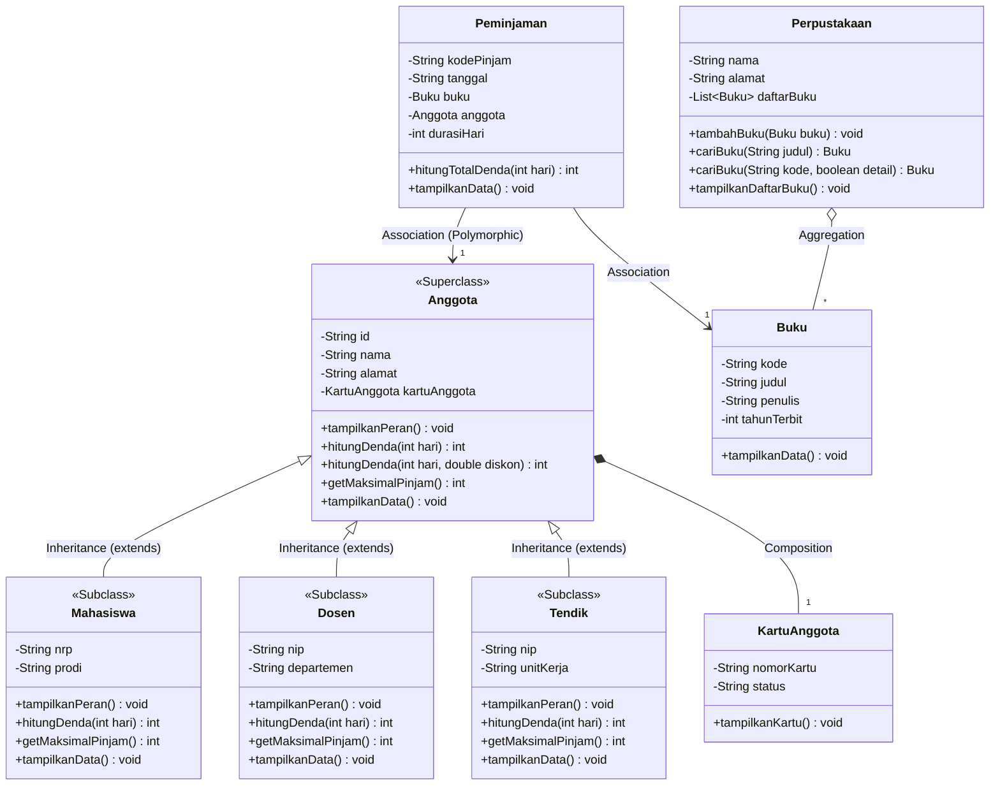

# LAPORAN PRAKTIKUM PEMROGRAMAN BERORIENTASI OBYEK
## MODUL 6: Polymorphism, Method Overriding, Method Overloading, dan Dynamic Binding

### 1. Profil Proyek
- **Nama Proyek:** Sistem Manajemen Perpustakaan (Polymorphic Behavior & Dynamic Dispatch)
- **Nama Mahasiswa / NRP:** Arjuna Lanang Adiwarsana / 3125522010
- **Program Studi / Kampus:** D3 PJJ Teknik Informatika - PENS PSDKU Sumenep
- **Mata Kuliah:** Workshop Pemrograman Berorientasi Obyek (PBO)
- **Fokus Pertemuan (P6):** Penerapan Runtime Polymorphism, Method Overriding (`@Override`), Compile-time Polymorphism (Method Overloading), Upcasting, Polymorphic Collection, serta Dynamic Binding.

---

### 2. Sprint Goal (P6)
Mengembangkan behavior objek pada proyek Sistem Manajemen Perpustakaan hasil P5 melalui method overriding, method overloading, upcasting, dan polymorphic collection sehingga subclass (`Mahasiswa`, `Dosen`, `Tendik`) dapat merespons pemanggilan method yang sama (`tampilkanPeran()`, `hitungDenda()`, `getMaksimalPinjam()`) dengan perilaku berbeda secara dinamis saat runtime (Dynamic Binding).

---

### 3. Sprint Backlog (P6)
| ID | Sprint Backlog Item | Status |
|---|---|---|
| **SB-01** | Audit superclass (`Anggota`) dan subclass P5 (`Mahasiswa`, `Dosen`) | **Done** |
| **SB-02** | Menentukan behavior polymorphic yang dioverride (`tampilkanPeran()`, `hitungDenda()`, `getMaksimalPinjam()`) | **Done** |
| **SB-03** | Implementasi overriding pada subclass dengan anotasi `@Override` (termasuk penambahan subclass `Tendik`) | **Done** |
| **SB-04** | Implementasi method overloading pada `Anggota` (`hitungDenda`) dan `Perpustakaan` (`cariBuku`) | **Done** |
| **SB-05** | Implementasi upcasting reference superclass ke instance subclass | **Done** |
| **SB-06** | Membuat dan menguji polymorphic collection (`Anggota[]`) dengan iterasi loop | **Done** |
| **SB-07** | Melakukan pengujian pembuktian dynamic method dispatch / dynamic binding | **Done** |

---

### 4. Bagian A: Audit Behavior & Hierarchy P5
Audit dilakukan terhadap hierarki pewarisan yang telah dibangun pada modul sebelumnya (P5):

```
       [Anggota] (Superclass)
          ▲
   ┌──────┼──────┐
   │      │      │
[Mahasiswa] [Dosen] [Tendik] (Subclasses)
```

**Identifikasi Behavior Polymorphic:**
| Superclass | Subclass | Method yang Di-override | Perilaku Spesifik Subclass |
|---|---|---|---|
| `Anggota` | `Mahasiswa` | `tampilkanPeran()` | Menampilkan peran mahasiswa (akses skripsi & akademik) |
| `Anggota` | `Mahasiswa` | `hitungDenda(int hari)` | Tarif denda terdiskon mahasiswa: Rp 500 / hari |
| `Anggota` | `Mahasiswa` | `getMaksimalPinjam()` | Batas peminjaman: 3 buku |
| `Anggota` | `Dosen` | `tampilkanPeran()` | Menampilkan peran dosen peneliti (akses jurnal & referensi khusus) |
| `Anggota` | `Dosen` | `hitungDenda(int hari)` | Hak istimewa akademik: Bebas denda (Rp 0) |
| `Anggota` | `Dosen` | `getMaksimalPinjam()` | Batas peminjaman: 5 buku |
| `Anggota` | `Tendik` | `tampilkanPeran()` | Menampilkan peran staf kependidikan (akses operasional) |
| `Anggota` | `Tendik` | `hitungDenda(int hari)` | Tarif denda staf: Rp 750 / hari |
| `Anggota` | `Tendik` | `getMaksimalPinjam()` | Batas peminjaman: 4 buku |

---

### 5. Bagian B: Pembaruan Class Diagram (UML)



---

### 6. Contoh Implementasi Kode

#### A. Method Overriding (Runtime Polymorphism)
Subclass mendefinisikan ulang method superclass dengan signature yang persis sama menggunakan `@Override`:
```java
// Pada Superclass Anggota:
public void tampilkanPeran() {
    System.out.println("Peran        : Anggota Umum Perpustakaan");
}

// Pada Subclass Mahasiswa:
@Override
public void tampilkanPeran() {
    System.out.println("Peran        : Mahasiswa (Akses Koleksi Skripsi & Akademik)");
}

// Pada Subclass Dosen:
@Override
public void tampilkanPeran() {
    System.out.println("Peran        : Dosen Pengajar & Peneliti (Akses Koleksi Jurnal & Referensi Khusus)");
}
```

#### B. Method Overloading (Compile-Time Polymorphism)
Method dengan nama yang sama tetapi parameter berbeda (jumlah/tipe data) dalam satu class yang sama:
```java
// Overloading 1 pada Anggota:
public int hitungDenda(int hariTerlambat) {
    return hariTerlambat * 1000;
}
public int hitungDenda(int hariTerlambat, double diskonPersen) {
    int dendaDasar = hitungDenda(hariTerlambat);
    return (int) (dendaDasar * (1.0 - (diskonPersen / 100.0)));
}

// Overloading 2 pada Perpustakaan:
public Buku cariBuku(String judul) { ... }
public Buku cariBuku(String kode, boolean cetakDetail) { ... }
```
*Alasan penggunaan:* Memberikan fleksibilitas bagi pemanggil method tanpa harus membuat nama method baru untuk fungsionalitas yang sejenis.

#### C. Upcasting & Polymorphic Reference
Upcasting adalah memperlakukan objek subclass sebagai tipe superclass-nya:
```java
Anggota refMhs = new Mahasiswa("A001", "Arjuna", "Sumenep", "3125522010", "D3 TI");
Anggota refDsn = new Dosen("A002", "Pak Nirwana", "Sumenep", "19880123", "Informatika");
Anggota refTdk = new Tendik("A003", "Ahmad Fauzi", "Sumenep", "19920515", "Akademik");
```
*Manfaat:* Memungkinkan polymorphic reference di mana kode dapat beroperasi secara generik pada tipe `Anggota` (seperti pada parameter `Peminjaman` dan array `Anggota[]`), namun mengeksekusi implementasi spesifik saat runtime.

---

### 7. Hasil Eksekusi Program (`Main.java`)
```text
=========================================================================
   PRAKTIKUM MODUL 6 - POLYMORPHISM, OVERRIDING & DYNAMIC BINDING        
   SISTEM MANAJEMEN PERPUSTAKAAN                                         
=========================================================================

=== 1. UJI UPCASTING & POLYMORPHIC REFERENCE ===
[Sukses] Tiga objek subclass berhasil di-upcast ke tipe reference superclass 'Anggota'.
refMhs (Tipe Reference: Anggota) -> Objek Aktual: Mahasiswa
refDsn (Tipe Reference: Anggota) -> Objek Aktual: Dosen
refTdk (Tipe Reference: Anggota) -> Objek Aktual: Tendik

=== 2. UJI METHOD OVERRIDING & DYNAMIC BINDING ===
--- Pemanggilan method tampilkanPeran() melalui Superclass Reference ---
refMhs.tampilkanPeran() -> Peran        : Mahasiswa (Akses Koleksi Skripsi & Akademik)
refDsn.tampilkanPeran() -> Peran        : Dosen Pengajar & Peneliti (Akses Koleksi Jurnal & Referensi Khusus)
refTdk.tampilkanPeran() -> Peran        : Tenaga Kependidikan / Staf (Akses Operasional & Umum)

--- Pemanggilan method hitungDenda(3 Hari Terlambat) via Dynamic Binding ---
Denda refMhs (Mahasiswa) : Rp 1500 (Tarif Mhs: Rp 500/hari)
Denda refDsn (Dosen)     : Rp 0 (Privilege Bebas Denda)
Denda refTdk (Tendik)    : Rp 2250 (Tarif Tendik: Rp 750/hari)

=== 3. UJI METHOD OVERLOADING (COMPILE-TIME POLYMORPHISM) ===
--- Overloading pada Anggota: hitungDenda() ---
1. hitungDenda(4 hari)           -> Rp 2000
2. hitungDenda(4 hari, diskon 50%) -> Rp 1000
[Sukses] Buku "Pemrograman Berorientasi Objek" ditambahkan ke koleksi Perpustakaan Terpadu PENS Sumenep
[Sukses] Buku "Struktur Data & Algoritma" ditambahkan ke koleksi Perpustakaan Terpadu PENS Sumenep

--- Overloading pada Perpustakaan: cariBuku() ---
1. cariBuku(String judul)     -> Ditemukan: Pemrograman Berorientasi Objek
2. cariBuku(String, boolean)  -> [Info Pencarian] Ditemukan buku: Struktur Data & Algoritma (Budi Raharjo)

=== 4. UJI POLYMORPHIC COLLECTION (ARRAY OF SUPERCLASS) ===
Melakukan iterasi polimorfik pada 4 elemen array Anggota[]:

---------------------------------------------------------
Elemen ke-1 [Tipe Objek: Mahasiswa]
---------------------------------------------------------
ID Anggota   : A001
Nama         : Arjuna Lanang Adiwarsana
Alamat       : Jl. Trunojoyo No. 45, Sumenep
Nomor Kartu  : KTA-A001 (Aktif)
NRP          : 3125522010
Program Studi: D3 PJJ Teknik Informatika
Peran        : Mahasiswa (Akses Koleksi Skripsi & Akademik)
Maks. Pinjam : 3 Buku
Simulasi Denda Terlambat 5 Hari : Rp 2500

---------------------------------------------------------
Elemen ke-2 [Tipe Objek: Dosen]
---------------------------------------------------------
ID Anggota   : A002
Nama         : Nirwana Haidar Hari, S.Pd., M.Kom.
Alamat       : Jl. Raya Lenteng No. 88, Sumenep
Nomor Kartu  : KTA-A002 (Aktif)
NIP          : 198801232024011001
Departemen   : Teknik Informatika
Peran        : Dosen Pengajar & Peneliti (Akses Koleksi Jurnal & Referensi Khusus)
Maks. Pinjam : 5 Buku
Simulasi Denda Terlambat 5 Hari : Rp 0

---------------------------------------------------------
Elemen ke-3 [Tipe Objek: Tendik]
---------------------------------------------------------
ID Anggota   : A003
Nama         : Ahmad Fauzi, S.Kom.
Alamat       : Jl. Jokotole No. 12, Sumenep
Nomor Kartu  : KTA-A003 (Aktif)
NIP          : 199205152020121002
Unit Kerja   : Bagian Administrasi & Akademik
Peran        : Tenaga Kependidikan / Staf (Akses Operasional & Umum)
Maks. Pinjam : 4 Buku
Simulasi Denda Terlambat 5 Hari : Rp 3750

---------------------------------------------------------
Elemen ke-4 [Tipe Objek: Mahasiswa]
---------------------------------------------------------
ID Anggota   : A004
Nama         : Siti Nurhaliza
Alamat       : Jl. Panglegur No. 05
Nomor Kartu  : KTA-A004 (Aktif)
NRP          : 3125522011
Program Studi: D3 PJJ Teknik Informatika
Peran        : Mahasiswa (Akses Koleksi Skripsi & Akademik)
Maks. Pinjam : 3 Buku
Simulasi Denda Terlambat 5 Hari : Rp 2500

=== 5. INTEGRASI TRANSAKSI PEMINJAMAN (RELASI POLYMORPHIC) ===
--- Data Transaksi Peminjaman 1 ---
Kode Pinjam    : PJ-001
Tanggal Pinjam : 2026-10-04
Durasi Pinjam  : 7 Hari
Peminjam       : Arjuna Lanang Adiwarsana
No. Kartu      : KTA-A001
Peran        : Mahasiswa (Akses Koleksi Skripsi & Akademik)
Buku Dipinjam  : Pemrograman Berorientasi Objek
Penulis Buku   : Nirwana Haidar
Denda Keterlambatan (jika terlambat 2 hari): Rp 1000

--- Data Transaksi Peminjaman 2 ---
Kode Pinjam    : PJ-002
Tanggal Pinjam : 2026-10-04
Durasi Pinjam  : 14 Hari
Peminjam       : Nirwana Haidar Hari, S.Pd., M.Kom.
No. Kartu      : KTA-A002
Peran        : Dosen Pengajar & Peneliti (Akses Koleksi Jurnal & Referensi Khusus)
Buku Dipinjam  : Struktur Data & Algoritma
Penulis Buku   : Budi Raharjo
Denda Keterlambatan (jika terlambat 2 hari): Rp 0

=========================================================================
   PENGUJIAN MODUL 6 SELESAI (SELURUH REQUIREMENT BERHASIL)              
=========================================================================
```

---

### 8. Tabel Pengujian Dynamic Binding
| Reference | Object Aktual | Method Dipanggil | Output yang Dihasilkan |
|---|---|---|---|
| `Anggota` | `Mahasiswa` | `tampilkanPeran()` | `"Peran : Mahasiswa (Akses Koleksi Skripsi & Akademik)"` |
| `Anggota` | `Dosen` | `tampilkanPeran()` | `"Peran : Dosen Pengajar & Peneliti (Akses Koleksi Jurnal)"` |
| `Anggota` | `Tendik` | `tampilkanPeran()` | `"Peran : Tenaga Kependidikan / Staf (Akses Operasional)"` |
| `Anggota` | `Mahasiswa` | `hitungDenda(3)` | `Rp 1.500 (Tarif Rp 500 / hari)` |
| `Anggota` | `Dosen` | `hitungDenda(3)` | `Rp 0 (Privilege Bebas Denda)` |
| `Anggota` | `Tendik` | `hitungDenda(3)` | `Rp 2.250 (Tarif Rp 750 / hari)` |

**Penjelasan Dynamic Binding:**
Mengapa method yang dijalankan berbeda walaupun referensi sama-sama bertipe `Anggota`? Hal ini terjadi karena pada Java, pemanggilan method instance non-static dilakukan melalui **Dynamic Method Dispatch** (Dynamic Binding) pada waktu eksekusi (*runtime*). JVM memeriksa tipe objek aktual yang dialokasikan di heap memory (bukan tipe reference variabelnya), lalu mengeksekusi tabel virtual method (`vtable`) milik objek konkret tersebut.

---

### 9. Sprint Review
| Item Evaluasi | Hasil Evaluasi |
|---|---|
| **Superclass dan subclass tersedia** | `Anggota` (Superclass) serta `Mahasiswa`, `Dosen`, `Tendik` (Subclasses) siap digunakan |
| **Method overriding berhasil** | Overriding method `tampilkanPeran()`, `hitungDenda()`, `getMaksimalPinjam()`, `tampilkanData()` berhasil |
| **Minimal 2 subclass memiliki behavior berbeda** | 3 subclass (`Mahasiswa`, `Dosen`, `Tendik`) memiliki kalkulasi denda, peran, dan kuota pinjam unik |
| **Method overloading tersedia** | Overloading pada `Anggota.hitungDenda()` dan `Perpustakaan.cariBuku()` berhasil |
| **Upcasting berhasil** | Reference `Anggota` berhasil menampung instance `Mahasiswa`, `Dosen`, dan `Tendik` |
| **Polymorphic collection berhasil** | Array `Anggota[]` berhasil menampung 4 objek subclass dan diiterasi secara polimorfik |
| **Dynamic binding dapat dibuktikan** | Terbukti method subclass yang terpanggil saat runtime melalui superclass reference |
| **Program berjalan** | Seluruh unit program terkompilasi dan berjalan 100% tanpa error |
| **Kendala** | Tidak ada kendala teknis berarti; seluruh requirement modul terpenuhi dengan optimal |

---

### 10. Sprint Retrospective
- **What Went Well?** Penerapan polymorphism dan dynamic binding membuat kode program jauh lebih fleksibel dan scalable (Open/Closed Principle). Relasi `Peminjaman` dan polymorphic collection pada `Perpustakaan` dapat memproses berbagai jenis anggota secara generik tanpa perlu percabangan `if-else` atau `instanceof` yang kaku.
- **What Went Wrong?** Diperlukan pemahaman mendalam antara perbedaan *compile-time polymorphism* (overloading: resolusi saat compile berdasarkan argumen) dengan *runtime polymorphism* (overriding: resolusi saat runtime berdasarkan instance aktual di heap).
- **Improvement:** Pada modul berikutnya (P7), superclass `Anggota` dapat diubah menjadi `abstract class` dengan `abstract method`, serta memperkenalkan `interface` (misal: `DendaPayable` atau `PeminjamPrivilege`) agar kontrak perilaku semakin terstandardisasi dan class superclass tidak dapat diinstansiasi langsung secara sembarangan.
