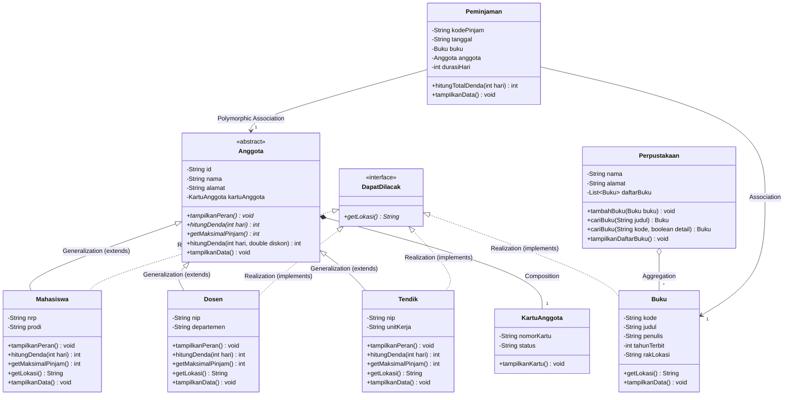
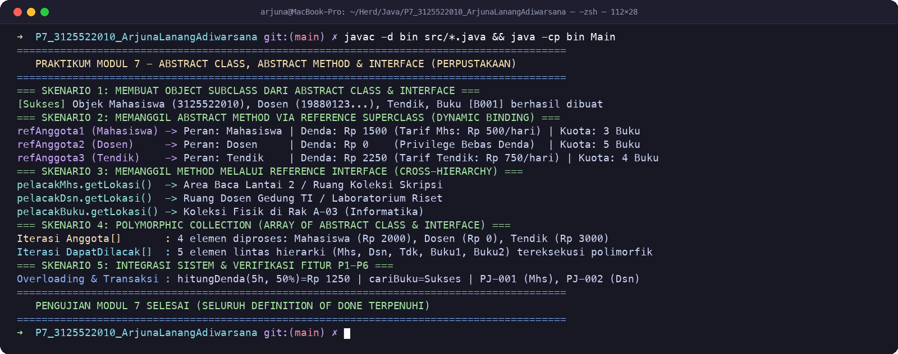

# LAPORAN PRAKTIKUM PEMROGRAMAN BERORIENTASI OBYEK
## MODUL 7: Abstract Class, Abstract Method, dan Interface
### Project Based Learning + Agile

---

### 1. Profil Proyek
- **Nama Proyek:** Sistem Manajemen Perpustakaan Terpadu (Refactoring Abstraction & Interface Contract)
- **Nama Mahasiswa / NRP:** Arjuna Lanang Adiwarsana / 3125522010
- **Program Studi / Kampus:** D3 PJJ Teknik Informatika - PENS PSDKU Sumenep
- **Mata Kuliah:** Workshop Pemrograman Berorientasi Obyek (PBO)
- **Dosen Pengampu:** Nirwana Haidar Hari, S.Pd., M.Kom.
- **Tahun Akademik:** 2026

---

### 2. Sprint Goal (P7)
Mengembangkan desain proyek P6 dengan menerapkan `abstract class` (`Anggota`) dan `interface` (`DapatDilacak`) yang sesuai sehingga struktur class lebih jelas, perilaku object memiliki kontrak yang konsisten, mencegah instansiasi superclass yang tidak spesifik, dan program tetap dapat dijalankan serta terintegrasi secara utuh.

---

### 3. Sprint Backlog (P7)
| ID | Sprint Backlog Item | Status |
|---|---|---|
| **SB-01** | Audit hierarchy dan behavior proyek P6 | **Done** |
| **SB-02** | Menentukan kandidat abstract class (`Anggota`) | **Done** |
| **SB-03** | Menentukan abstract method (`tampilkanPeran()`, `hitungDenda()`, `getMaksimalPinjam()`) | **Done** |
| **SB-04** | Menentukan kandidat interface (`DapatDilacak` dengan method `getLokasi()`) | **Done** |
| **SB-05** | Memperbarui class diagram UML (notasi generalization & realization) | **Done** |
| **SB-06** | Mengimplementasikan abstract class dan interface pada kode Java | **Done** |
| **SB-07** | Menguji polymorphism (4 skenario pengujian) dan memverifikasi program | **Done** |

---

### 4. Bagian A – Audit Desain P6
Berdasarkan hasil analisis terhadap struktur class P6, dilakukan audit desain untuk memisahkan antara konsep umum yang membutuhkan standarisasi template (`abstract class`) dan kontrak kapabilitas lintas hierarki (`interface`):

| Class / Behavior | Kondisi P6 | Rencana P7 | Alasan Perubahan Desain |
|---|---|---|---|
| `Anggota` | Class biasa (Konkret) | `Abstract class` | `Anggota` hanya mewakili konsep umum abstrak pengguna perpustakaan. Objek nyata harus spesifik (`Mahasiswa`, `Dosen`, atau `Tendik`) dan tidak boleh diinstansiasi secara langsung (`new Anggota()`). |
| `tampilkanPeran()` | Method biasa | `Abstract method` | Setiap subclass memiliki peran dan hak akses katalog yang berbeda, sehingga subclass wajib mendefinisikan perilakunya sendiri. |
| `hitungDenda(int)` | Method biasa (implementasi default) | `Abstract method` | Tarif denda keterlambatan bersifat spesifik untuk masing-masing tipe anggota (Mahasiswa: Rp 500/hari, Dosen: Rp 0, Tendik: Rp 750/hari). |
| `getMaksimalPinjam()` | Method biasa | `Abstract method` | Batas kuota pinjam buku wajib disesuaikan dengan jenis keanggotaan akademik. |
| `DapatDilacak` | Belum ada | `Interface` (`getLokasi()`) | Menentukan kontrak kemampuan pelacakan lokasi fisik yang dapat diterapkan oleh berbagai class yang tidak sehierarki (`Mahasiswa`, `Dosen`, `Tendik`, dan `Buku`). |

---

### 5. Bagian B – Pembaruan Class Diagram (UML)



---

### 6. Bagian C, D, E – Implementasi Abstract Class, Subclass & Interface

#### Perbandingan Abstract Class vs Interface
| Aspek | Abstract Class (`Anggota`) | Interface (`DapatDilacak`) |
|---|---|---|
| **Fungsi Utama** | Mewakili konsep umum superclass, berbagi state/atribut, dan menyediakan kerangka dasar bagi hierarki keanggotaan. | Menentukan kontrak perilaku (*behavior contract*) yang dapat diterapkan lintas class tanpa batasan hierarki pewarisan. |
| **Keyword** | `abstract class` dan `extends` | `interface` dan `implements` |
| **Atribut / State** | Dapat memiliki atribut instance (`id`, `nama`, `alamat`, `kartuAnggota`). | Tidak memiliki atribut instance (hanya konstanta `public static final`). |
| **Constructor** | Memiliki constructor untuk inisialisasi state superclass (`super(id, nama, alamat)`). | Tidak memiliki constructor. |
| **Method** | Kombinasi abstract method (`hitungDenda`, `tampilkanPeran`) dan method konkret (`hitungDenda(int, double)`, `tampilkanData`). | Hanya deklarasi method tanpa implementasi (atau default/static method di Java modern). |
| **Hubungan Class** | Single inheritance (satu class hanya dapat `extends` satu superclass). | Multiple realization (satu class dapat `implements` banyak interface). |

---

### 7. Bagian F – Pengujian Polymorphism (4 Skenario Pengujian)

| No | Skenario Pengujian | Objek / Reference yang Digunakan | Method yang Dipanggil | Hasil yang Diharapkan | Hasil Pengujian & Status |
|---|---|---|---|---|---|
| **1** | **Membuat Objek Subclass** | `Mahasiswa`, `Dosen`, `Tendik`, `Buku` | Konstruktor masing-masing class | Seluruh instance objek berhasil dialokasikan di memory heap | **Sukses:** Seluruh objek berhasil dibuat dengan atribut valid |
| **2** | **Memanggil Abstract Method via Reference Superclass** | Reference bertipe `Anggota` (`refAnggota1`, `refAnggota2`, `refAnggota3`) | `tampilkanPeran()`, `hitungDenda(3)`, `getMaksimalPinjam()` | JVM mengeksekusi implementasi unik milik subclass aktual (Dynamic Binding) | **Sukses:** `Mahasiswa` (Rp 1.500), `Dosen` (Rp 0), `Tendik` (Rp 2.250) |
| **3** | **Memanggil Method via Reference Interface** | Reference bertipe `DapatDilacak` (`pelacakMhs`, `pelacakDsn`, `pelacakBuku`) | `getLokasi()` | Method `getLokasi()` pada class yang berbeda hierarki berhasil dieksekusi | **Sukses:** Mahasiswa (Area Baca Lt.2), Dosen (Ruang Dosen), Buku (Rak A-03) |
| **4** | **Array Polimorfik Superclass & Interface** | `Anggota[]` dan `DapatDilacak[]` | `tampilkanData()`, `hitungDenda()`, `getLokasi()` dalam loop | Setiap elemen array mengeksekusi perilakunya sendiri saat diiterasi | **Sukses:** Iterasi polimorfik berjalan konsisten dan dinamis |

---

### 8. Bukti Hasil Eksekusi Program (Terminal Output)



```text
=========================================================================
   PRAKTIKUM MODUL 7 - ABSTRACT CLASS, ABSTRACT METHOD & INTERFACE       
   SISTEM MANAJEMEN PERPUSTAKAAN (PROJECT BASED LEARNING + AGILE)        
=========================================================================

=== SKENARIO 1: MEMBUAT OBJECT SUBCLASS DARI ABSTRACT CLASS & INTERFACE ===
[Sukses] Seluruh object subclass berhasil diinstansiasi:
1. Objek Mahasiswa : Arjuna Lanang Adiwarsana (NRP: 3125522010)
2. Objek Dosen     : Nirwana Haidar Hari, S.Pd., M.Kom. (NIP: 198801232024011001)
3. Objek Tendik    : Ahmad Fauzi, S.Kom. (Unit: Bagian Administrasi & Akademik)
4. Objek Buku      : Pemrograman Berorientasi Objek [B001]

=== SKENARIO 2: MEMANGGIL ABSTRACT METHOD VIA REFERENCE SUPERCLASS (DYNAMIC BINDING) ===
--- Pemanggilan Abstract Method: tampilkanPeran() ---
refAnggota1 (Mahasiswa) -> Peran        : Mahasiswa (Akses Koleksi Skripsi & Akademik)
refAnggota2 (Dosen)     -> Peran        : Dosen Pengajar & Peneliti (Akses Koleksi Jurnal & Referensi Khusus)
refAnggota3 (Tendik)    -> Peran        : Tenaga Kependidikan / Staf (Akses Operasional & Umum)

--- Pemanggilan Abstract Method: hitungDenda(3 Hari) & getMaksimalPinjam() ---
refAnggota1 -> Denda: Rp 1500 | Kuota Pinjam: 3 Buku (Tarif Mahasiswa)
refAnggota2 -> Denda: Rp 0 | Kuota Pinjam: 5 Buku (Privilege Dosen)
refAnggota3 -> Denda: Rp 2250 | Kuota Pinjam: 4 Buku (Tarif Tendik)

=== SKENARIO 3: MEMANGGIL METHOD MELALUI REFERENCE INTERFACE (CROSS-HIERARCHY) ===
[Sukses] Pemanggilan method getLokasi() melalui Reference Interface DapatDilacak:
1. pelacakMhs.getLokasi()  -> Area Baca Lantai 2 / Ruang Koleksi Skripsi
2. pelacakDsn.getLokasi()  -> Ruang Dosen Gedung TI / Laboratorium Riset
3. pelacakBuku.getLokasi() -> Koleksi Fisik di Rak A-03 (Informatika)

=== SKENARIO 4: POLYMORPHIC COLLECTION (ARRAY OF ABSTRACT CLASS & INTERFACE) ===
--- Bagian 4A: Iterasi Polimorfik Array Anggota[] (Abstract Superclass) ---
>> Anggota ke-1 [Mahasiswa]:
ID Anggota   : A001
Nama         : Arjuna Lanang Adiwarsana
Alamat       : Jl. Trunojoyo No. 45, Sumenep
Nomor Kartu  : KTA-A001 (Aktif)
NRP          : 3125522010
Program Studi: D3 PJJ Teknik Informatika
Peran        : Mahasiswa (Akses Koleksi Skripsi & Akademik)
Maks. Pinjam : 3 Buku
Lokasi Akses : Area Baca Lantai 2 / Ruang Koleksi Skripsi
   Simulasi Denda Terlambat 4 Hari: Rp 2000

>> Anggota ke-2 [Dosen]:
ID Anggota   : A002
Nama         : Nirwana Haidar Hari, S.Pd., M.Kom.
Alamat       : Jl. Raya Lenteng No. 88, Sumenep
Nomor Kartu  : KTA-A002 (Aktif)
NIP          : 198801232024011001
Departemen   : Teknik Informatika
Peran        : Dosen Pengajar & Peneliti (Akses Koleksi Jurnal & Referensi Khusus)
Maks. Pinjam : 5 Buku
Lokasi Akses : Ruang Dosen Gedung TI / Laboratorium Riset
   Simulasi Denda Terlambat 4 Hari: Rp 0

>> Anggota ke-3 [Tendik]:
ID Anggota   : A003
Nama         : Ahmad Fauzi, S.Kom.
Alamat       : Jl. Jokotole No. 12, Sumenep
Nomor Kartu  : KTA-A003 (Aktif)
NIP          : 199205152020121002
Unit Kerja   : Bagian Administrasi & Akademik
Peran        : Tenaga Kependidikan / Staf (Akses Operasional & Umum)
Maks. Pinjam : 4 Buku
Lokasi Akses : Bagian Administrasi & Layanan Akademik Kampus
   Simulasi Denda Terlambat 4 Hari: Rp 3000

>> Anggota ke-4 [Mahasiswa]:
ID Anggota   : A004
Nama         : Siti Nurhaliza
Alamat       : Jl. Panglegur No. 05
Nomor Kartu  : KTA-A004 (Aktif)
NRP          : 3125522011
Program Studi: D3 PJJ Teknik Informatika
Peran        : Mahasiswa (Akses Koleksi Skripsi & Akademik)
Maks. Pinjam : 3 Buku
Lokasi Akses : Area Baca Lantai 2 / Ruang Koleksi Skripsi
   Simulasi Denda Terlambat 4 Hari: Rp 2000

--- Bagian 4B: Iterasi Polimorfik Array DapatDilacak[] (Interface Reference) ---
Pelacak ke-1 [Mahasiswa] -> Lokasi: Area Baca Lantai 2 / Ruang Koleksi Skripsi
Pelacak ke-2 [Dosen] -> Lokasi: Ruang Dosen Gedung TI / Laboratorium Riset
Pelacak ke-3 [Tendik] -> Lokasi: Bagian Administrasi & Layanan Akademik Kampus
Pelacak ke-4 [Buku] -> Lokasi: Koleksi Fisik di Rak A-03 (Informatika)
Pelacak ke-5 [Buku] -> Lokasi: Koleksi Fisik di Rak B-01 (Algoritma)

=== SKENARIO 5: INTEGRASI SISTEM & VERIFIKASI FITUR P1-P6 ===
1. Uji Method Overloading Anggota.hitungDenda():
   - Standar 5 hari (Mahasiswa) : Rp 2500
   - Diskon 50% 5 hari (Mahasiswa): Rp 1250
[Sukses] Buku "Pemrograman Berorientasi Objek" ditambahkan ke koleksi Perpustakaan Terpadu PENS Sumenep
[Sukses] Buku "Struktur Data & Algoritma" ditambahkan ke koleksi Perpustakaan Terpadu PENS Sumenep

2. Uji Method Overloading Perpustakaan.cariBuku():
   - cariBuku(judul)    -> Ditemukan: Pemrograman Berorientasi Objek
   - cariBuku(kode, cetakDetail) -> [Info Pencarian] Ditemukan buku: Struktur Data & Algoritma (Budi Raharjo) di Koleksi Fisik di Rak B-01 (Algoritma)

3. Uji Transaksi Peminjaman (Relasi Asosiasi Polimorfik):
--- Detail Transaksi 1 ---
Kode Pinjam    : PJ-001
Tanggal Pinjam : 2026-10-06
Durasi Pinjam  : 7 Hari
Peminjam       : Arjuna Lanang Adiwarsana
No. Kartu      : KTA-A001
Peran        : Mahasiswa (Akses Koleksi Skripsi & Akademik)
Buku Dipinjam  : Pemrograman Berorientasi Objek
Penulis Buku   : Nirwana Haidar
Lokasi Koleksi : Koleksi Fisik di Rak A-03 (Informatika)
Total Denda (Keterlambatan 3 Hari): Rp 1500

--- Detail Transaksi 2 ---
Kode Pinjam    : PJ-002
Tanggal Pinjam : 2026-10-06
Durasi Pinjam  : 14 Hari
Peminjam       : Nirwana Haidar Hari, S.Pd., M.Kom.
No. Kartu      : KTA-A002
Peran        : Dosen Pengajar & Peneliti (Akses Koleksi Jurnal & Referensi Khusus)
Buku Dipinjam  : Struktur Data & Algoritma
Penulis Buku   : Budi Raharjo
Lokasi Koleksi : Koleksi Fisik di Rak B-01 (Algoritma)
Total Denda (Keterlambatan 3 Hari): Rp 0

=========================================================================
   PENGUJIAN MODUL 7 SELESAI (SELURUH DEFINITION OF DONE TERPENUHI)       
=========================================================================
```

---

### 9. Sprint Review (Checklist 7/7 Item Terverifikasi)
| Item Checklist Sprint Review | Status | Keterangan Verifikasi |
|---|---|---|
| **Abstract class berhasil dibuat** | ✅ **Terverifikasi** | Class `Anggota` dideklarasikan sebagai `public abstract class` dengan constructor dan state. |
| **Abstract method diimplementasikan subclass** | ✅ **Terverifikasi** | Subclass `Mahasiswa`, `Dosen`, dan `Tendik` mengimplementasikan `tampilkanPeran()`, `hitungDenda()`, dan `getMaksimalPinjam()`. |
| **Minimal 2 subclass dapat digunakan** | ✅ **Terverifikasi** | 3 subclass (`Mahasiswa`, `Dosen`, `Tendik`) aktif digunakan dalam transaksi dan polymorphic collection. |
| **Interface berhasil diimplementasikan** | ✅ **Terverifikasi** | Interface `DapatDilacak` berhasil diimplementasikan pada class `Mahasiswa`, `Dosen`, `Tendik`, dan `Buku`. |
| **Class diagram sesuai dengan kode** | ✅ **Terverifikasi** | Notasi Generalization (`extends`) dan Realization (`implements`) pada UML 100% konsisten dengan kode Java. |
| **Pengujian polymorphism berhasil** | ✅ **Terverifikasi** | 4 skenario pengujian (subclass instansiasi, superclass reference, interface reference, array collection) sukses diuji. |
| **Fitur proyek sebelumnya tetap berjalan** | ✅ **Terverifikasi** | Relasi agregasi, komposisi `KartuAnggota`, overloading `hitungDenda`/`cariBuku`, dan transaksi `Peminjaman` tetap berfungsi normal. |

---

### 10. Sprint Retrospective
- **What Went Well?**
  Implementasi `abstract class` pada `Anggota` berhasil mengeliminasi instansiasi ambigu superclass dan memaksakan setiap jenis anggota memiliki kalkulasi denda, kuota pinjam, serta peran yang eksplisit. Selain itu, interface `DapatDilacak` membuktikan fleksibilitas OOP modern dengan mengikat class yang berbeda hierarki (`Anggota` dan `Buku`) dalam satu kontrak kemampuan pelacakan lokasi fisik.
- **What Went Wrong?**
  Perlu pemahaman ketat dalam membedakan kapan menggunakan `abstract class` (konsep `is-a` dengan *shared state* dan *code reuse*) versus `interface` (kontrak kemampuan `can-do` tanpa menyimpan *instance state*).
- **Improvement:**
  Sebagai persiapan menghadapi Evaluasi UTS (P8) dan Modul P9, seluruh relasi antar-objek (Agregasi, Komposisi, Asosiasi, Generalization, Realization) telah distandarisasi secara modular sehingga siap diperluas dengan fitur sistem reservasi dan denda otomatis.

---

### 11. Definition of Done (Checklist 15/15 Terpenuhi)
- [x] 1. Menggunakan proyek hasil P6
- [x] 2. Audit desain dan alasan penggunaan abstraksi tersedia
- [x] 3. Minimal 1 abstract class yang relevan dibuat (`Anggota`)
- [x] 4. Minimal 1 abstract method dibuat (`tampilkanPeran`, `hitungDenda`, `getMaksimalPinjam`)
- [x] 5. Minimal 2 subclass konkret mengimplementasikan abstract method (`Mahasiswa`, `Dosen`, `Tendik`)
- [x] 6. Minimal 1 interface dibuat (`DapatDilacak`)
- [x] 7. Minimal 2 class mengimplementasikan interface yang relevan (`Mahasiswa`, `Dosen`, `Tendik`, `Buku`)
- [x] 8. Polymorphism melalui superclass dan interface dapat dibuktikan
- [x] 9. Class diagram diperbarui dan konsisten dengan kode
- [x] 10. Program berhasil dikompilasi dan dijalankan
- [x] 11. Minimal 4 skenario pengujian tersedia
- [x] 12. Fitur proyek sebelumnya tetap berjalan
- [x] 13. Sprint Backlog diperbarui
- [x] 14. Sprint Review tersedia
- [x] 15. Sprint Retrospective tersedia
